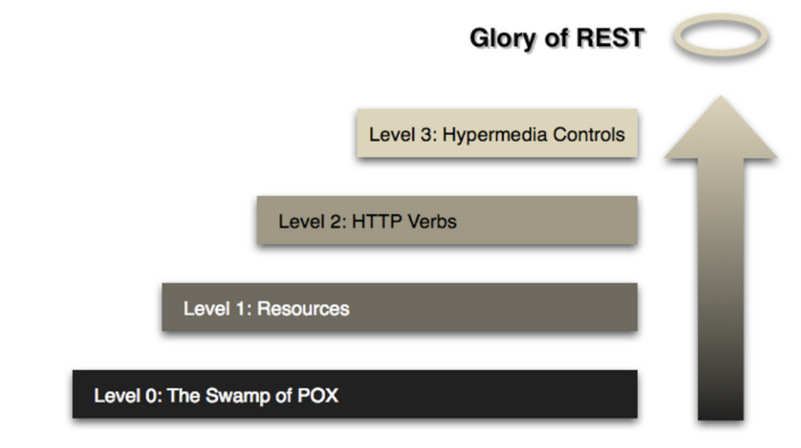

📌 API란?
-
* api는 api 공급자와 api 소비자 간의 계약이다.
* 이 중 REST 는 간단하게 활용하고, 이해하기 쉽기 때문에 가장 많이 활용되는 API 스타일 줄 하나이다.


<br/>

📌 REST
-
* REpresentational State Transfer 의 약어이다.
* api에서 사용되는 스타일 중 하나이다.


<br/>

📌 RESTful API 정의
-
* REST 아키텍처의 제약조건을 준수하는 웹 서비스 API를 RESTful API 라고 부른다.


<br/>

📌 REST 아키텍처의 제약 사항
-
* 클라이언트-서버
    * "데이터 저장소"의 관심사와 "사용자 인터페이스"의 관심사를 분리해내는 것
    * 클라이언트는 브라우저 내부에서 요청을 하는 쪽(프런트엔드)이다.
    * 서버는 데이터 저장소의 데이터를 제공하는 쪽이다.

* 무상태성
    * 클라이언트와 서버간 무상태성을 가진다.
    * 즉, 서버는 클라이언트 요청한 컨텍스트를 서버에 저장하지 않음
        * 따라서 로그인이 없음
        * 따라서 세션을 사용하지 않음
        * 따라서 클라이언트는 서버가 요청을 이해하기 위해 필요한 모든 정보를 제공해야함

* 캐시
    * 시스템 성능과 관련된 것 
    * 클라이언트는 요청에 대해 시스템이 캐시해도 되는 것인지 아닌지 알려줘야 함
    * Cache-Control, ETag, Expires 같은 HTTP 헤더를 사용해서 캐시를 제어할 수 있음

* 유니폼 인터페이스
    * REST 아키텍처 스타일이, SOAP 같은 다른 스타일과 구별되는 중심 기능
    * URL의 계층(슬래시로 구분되는 영역)과 메소드(GET, PUT ...) 등과 같은 한정된 자원을 가지고 자원을 제어하는 것이 유니폼 인터페이스의 일종이다.
    * 시스템의 아키텍처가 간순화되고 상호작용의 가시성이 향상된다.
    * 리소스 식별, 표현을 통한 리소스 조작, 가시 서술 메세지, 애플리케이션 상태의 엔진으로서의 하이퍼 미디어 등, 네가지 인터페이스 제약 사항이 존재

* 계층형 시스템
    * 클라이언트, 서버는 서로의 관심사에는 관심도 없고 관여할 수도 없고 상호작용하지도 않음

* 주문형 코드 (Code-On-Demand)
    * REST 아키텍처의 선택 사항
    * 스크립트 형태로 코드를 다운로드 하고 실행함 => 클라이언트 기능 확장
    * 가공해야하는 데이터를 보내는 것 대신, 바로 코드를 보내서 실행함으로써, 클라이언트 기능이 확장 된다는 것 


<br/>

📌 RESTful 인터페이스 제약사항 (조금 더 구체적인 제약사항)
-
* 리소스 식별
    * REST 에서 리소스는 서비스측에서 클라이언트에게 제공할 수 있는 정보를 추상화 한 것 (특정 형식으로 가공될 수 있는 형식, XML, JSON 등등으로 만든 것)
    * 추상화 된 리소스의 본질은 문서, 이미지, 작업일 수 있다.
    * 리소스는 URI를 통해 고유하게 실별할 수 있어야 한다.
    
    ```html
    https://api.example.com/v1/tasks/1
    ```
    
    1번 작업을 식별할 수 있는 URI

* 표현을 통한 리소스 조작
    * 리소스와 메소드를 이용해서 서버에 무엇을 할지 알리는 것이다.
    * 메소드에는 GET, POST, PUT, PATCH, DELETE 등이 있다.

* 자기 서술 메세지
    * URI나, 해더 등에 하려고 하는 모든 동작에 대한 정보를 담는 특징
    * 이것을 통해서 클라이언트와 서버간 무상태성이 될 수 있음(서버 측에서 필요한 정보는 모두 클라이언트에서 제공하므로 저장해둘 필요 x)

* 애플리케이션 상태 엔진으로서의 하이퍼미디어
    * HATEOAS 또는 하이퍼미디어 제약(hypermedia constraint)으로 부르는 제약임
    * 하이퍼 텍스트 주도 방식이라고도 함
    * 클라이언트 측에서 리소스를 서버에 보냈을 때, 서버가 이용 가능한 동작(리소스)을 클라이언트에게 URL 형태로 보내주는 것이다.
    * 이는 REST의 제약사항이기는 하나 API 표준은 아니며, 이를 만족하지 않아도 RESTful API라고 부를 수 있다.


📌 리처드슨 성숙도 모델에 따른 RESTful API의 레벨
-



* 0 LEVEL
    * 단일 URL(아마 파라미터로 식별할 듯)와 단일 HTTP 메소드 사용
    * 대부분 HTTP POST 메소드를 활용해서 SOAP 기반에 페이로드를 전송한다.
    * XML-RPC 기반의 서비스가 있다.

* 1 LEVEL
    * 각 리소스에 대한 고유한 URL을 사용하나, HTTP 메소드가 단일
    * 대표적으로 Flickr 웹서비스가 있다.

* 2 LEVEL
    * 숫자로 지정이 가능한 URL 리소스를 제공. 
    * GET, PUT, POST, PATCH, DELETE 같은 다양한 메소드를 통해 리소스를 조작할 수 있도록 지원
    * 대표적으로 아마존의 파일 호스팅 서비스인 S3가 있다. 
    * 여기서 부터는 RESTful이라고 할 수 있다.
    
* 3 LEVEL
    * 레벨 2의 사항을 모두 만족하고 이와 더불어 하이퍼미디어 제약을 적용한 서비스이다.
    * 하이퍼미디어 제약을 활용해서 URI 기반으로 리소스와 가능한 작업 리스트들을 제공한다.
    * 대표적으로 페이팔의 RESTful API가 있다.

보통 LEVEL 3까지는 구현하지 않는데, 이는 LEVEL 2까지만 구현해도 RESTful 을 충족해서 얻는 이점은 충분히 얻어갈 수 있기 때문이고 하이퍼미디어 제약을 구현하는 오버헤드가 수고대비 이점이 없기 때문이다.  
그래서 LEVEL 3 서비스를 "순수 RESTful" 이라고 부르고 LEVEL 2 서비스를 "실용적 RESTful"이라고 부른다.


<br/>


HATEOAS(하이퍼미디어 제약)이란 무엇인가?
-

이에 대해 더 논의하기 전에 다음과 같은 RESTful API를 이용해 커피 한 잔을 구매하는 널리 활용되는 HATEOAS 사용 예제를 살펴보자.
```html
POST https://api.examplebucks.org/orders HTTP/1.1
Content-Type: application/json
Content-Length: 33
```
```html
{"drink": "latte", "quantity": 1}
```
이것은 라떼 한잔을 주문하기 위해 전송한 POST 요청이다. 서버는 위 요청에 대한 응답으로 아래와 같은 정보를 제공한다.
```html
{
    "id": 12345,
    "drink": "latte",
    "quantity": 1,
    "cost": "5",
    "status": "pending", 
    "_links" : {
        "self" : { 
            "href": "https://api.examplebucks.org/orders/12345",
            "type": "GET"
        },
        "payment": {
            "href": "https://api.examplebucks.org/payments/12345",
            "type": "PUT"
        },
        "update": {
            "href": "https://api.examplebucks.org/orders/12345",
            "type": "PUT"
        },
        "cancel": {
            "href": "https://api.examplebucks.org/orders/12345",
            "type": "DELETE"
        }
    }
}
```
* 순서대로
    1. 요청한 내용 (self)
    2. 계산서 만들기
    3. 주문 업데이트
    4. 주문 취소하기 

* HAL 구약을 따르는 하이퍼텍스트인 _links 프로퍼티는 클라이언트가 수행할 수 있는 작업을 포함한다.  
    * (여기서 HAL 이란 HyperText Application Language의 줄임말로 하이퍼미디어를 정의하는 표준 규약으로 JSON 또는 XML 코드 내에 외부 리소스인 links를 포함한다.)

* 여기서 _links 프로퍼티는 클라이언트가 수행할 수 있는 작업을 포함
    * href 는 리소스
    * type은 해당 리소스에 수행되어야 하는 HTTP 메소드이다.


* 클라이언트가, 주문서를 취소하고 싶으면 _links의 cancel 프로퍼티를 찾으면 그만
* 위와 같이 해서 얻는 이점은, API를 변경하고 싶을 때, 새로운 URI 주소만 클라이언트에게 보냄으로써, 클라이언트 내부적인 소스의 변경 없이 API를 변경할 수 있다.
* 또한 클라이언트는 URI를 더는 하드 코딩할 필요가 없다.
    * 그들이 이해해야할 것은 오직 _links 프로퍼티에서 반환된 각 작업의 의미이다.


<br/>

📌 HATEOAS(Hypertext As The Engine Of Application State)의 비 효율성
-
* HATEOAS 를 구현하고 유지 관리를 하려면 서버와 클라이언트 모두 노력이 필요함
    * 서버측에서 : 리소스의 상태를 기반으로 하이퍼텍스트를 구성해야함
    * 클라이언트측에서 : 하이퍼텍스트의 의미를 분석하고 이해해야함

* HATEOAS를 채택함으로써 리소스의 URI와 클라이언트를 분리하는 것에 대한 이점이 확실하기 않다.
    * 클라이언트는 수행해야할 작업을 확인하기 위해서, 하이퍼텍스트의 의미를 여전히 알아야함.
    * 그리고 확장에 대해서도 여전히 많은 노력을 기울여야 한다.
        * 대부분의 시간을 API를 변경하는데 사용하는 것이 불가피 하므로 이러한 변경 사항을 관리하기 위해서 버전관리가 필수 이다. => 페이팔이 URI에 v1 같은 버전을 덧 붙여 버전관리를 하는 이유이다.

* API의 응답을 통해 하이퍼텍스트가 제공하는 API의 자기 서술은 전체가 아닌, 일부다. 즉, 여전히 하이퍼 텍스트에 나열된 해당 작업에 대한 모든 정보를 찾으려면 다른 문서를 확인해야 한다. 차라리 API 문서를 클라이언트 개발자에게 제공하는 것이 나을 수도 있다.
* 하이퍼텍스트는 우회될 수 있다. 클라이언트는 요청을 통해 얻은 리소스(하이퍼텍스트)를 무시하고 다른 URI를 요청할 수도 있음.

📌 요약
-
API 클라이언트 개발자에게 실제로 도움이 될 수 있는 곳에서 HATEOAS를 활용해야 한다.  
예를 들어, 다음은 지불된 모든 주문을 검색할 수 있는 API에 대한 응답이다. 그것은 페이징 처리를 지원한다.

```html
{
    "items": [{...}],
    "paging": {
        "previous": "https://api.examplebucks.org/order?page=1&count=20&status=paid",
        "next": https://api.examplebucks.org/order?page=3&count=20&status=paid",
        "hasMore": true
    }
}
```
보다시피 이전 페이지와 다음 페이지의 URI를 추가해 API 클라이언트의 개발자가 URI를 구성하지 않고도 모든 페이지를 쉽게 검색할 수 있다.  
이는 특히 URI에 추가해야하는 모든 쿼리 매개변수를 기억하는데 도움이 된다.


<br/>


📌 RESTful API의 모범(이상)
-
* 리소스 중심적
    * 비즈니스 실체에 초점을 맞춰 필요한 리소스를 잘 반영할 수 있어야 한다.

* URI를 통한 식별 기능
    * 동사 대신 명사를 기반으로 리소스를 식별할 수 있어야 함. 컬렉션(모음)인 경우 복수형으로 작성
        * 주문 컬렉션 : https://api.examplebucks.org/v1/orders
        * ID가 1234인 주문 : https://api.examplebucks.org/v1/orders/1234
        * 사용자 컬렉션 : https://api.examplebucks.org/v1/users
        * ID가 567인 사용자 : https://api.examplebucks.org/v1/users/567

* HTTP 메소드를 통한 작업 정의
    * HTTP 메소드르르 통해 수행할 수 있는 작업을 정의해야함. 일반적으로 
        
        * GET 메소드
            * 리소스를 검색한다. 
            * 여러번 호출할 수 있고, 캐싱이 가능하다. 
            * GET 작업을 수행한다는 것은 리소스에 어떤 영향도 끼져선 안된다.(수정, 삭제)
       
        * POST 메소드 
            * 새로운 리소스를 생성할 때 사용(insert). 
            * 리소스의 식별자는 서버측에서 생성함(Auto Increments).
            * API의 응답에는 새로운 리소스에 대한 세부 사항(정보)이 포함된다.
            * 불안전한 작업이다. => 멱등성이 없고 여러번 실행하면 계속 새로운 리소스를 생성할 것이다.
        
        * PUT 메소드
            * 새로운 리소스 생성 또는 업데이트 
            * 클라이언트는 리소스에 대한 URI를 선택하고, 요청 본문에는 새로 교체할 리소스를 포함해야한다. => 이미 존재하는 경우 대체, 없으면 생성
            * PUT과 POST 차이점은 PUT 요청에서 리소스 식별자가 클라이언트에 의해 지정된다는 점이다.
            * 서버가 해당 클라이언트가 리소스 식별자 선택하는 것을 허용하지 않으면 PUT은 UPDATE 할 때만 사용 된다. => 존재하지 않으면 404응답을 반환할 것이다.
            * PUT 메소드는 같은 효과가 여러번 수행 될 수 있는 방식으로 구현 되어야 한다. => 멱등성(여러번 해도 달라지지 않음)이 있다.
        
        * PATCH 메소드 
            * PATCH 메소드는 기존 리소스의 일부를 업데이트 한다.
            * 리소스의 교체할 일부만을 요청과 같이 보낸다.
            * 이 메소드는 불안전하고 멱등성도 아니다.
        
        * DELETE 메스도
            * DELETE 메소드는 지정된 URI에서 기존의 리소스를 제거
            * DELETE 메소드는 멱등성을 띄기 때문에 여러번 수행하면 해당 리소스의 상태는 항상 같다(활용할 수 없게 되는 상태)


* HTTP 상태 코드
    * HTTP는 어떻게 사용하면 좋은지 정의한 내용이다. RESTful API를 구현하는 사람이라면 아래와 같은 응답코드를 사용할 수 있으면 된다.
    
    * 200 OK
        * GET, PUT, PATCH 요청이 성공함.
        * 리소스 생성이 아닌 작업에 사용한 POST 요청이나 DELETE 요청에도 활용 될 수 있음
    
    * 201 작성(Created)
        * 새로운 리소스 생성을 위한 POST 요청 또는 PUT 요청이 성공했음을 알림
        * 일반적으로 location 해더에 새로운 리소스의 URI와 함께 반환함
    
    * 204 내용 없음(No Content)
        * DELETE 요청과 같은 응답 본문을 포함하지 않는 성공적인 요청을 나타냄
    
    * 304 수정되지 않음(Not Modified)
        * 마지막 요청 이후 리소스가 수정되지 않았음을 의미 
        * 일반적으로 클라이언트 측에서, if-Modified-Since 와 같은 헤더를 제공해서 비교할 시간을 제공해줘야 한다.
    
    * 4xx 클라이언트 에러
        * 400 잘못된 요청(Bad Request)
            * 클라이언트 에러로 인식되는 어떤 것으로 인해 서버가 해당 요청을 처리하지 못함.
            * 요청 형식이 잘못 되었거나, 유효성 검사에 실패한 것이다.
        * 401 권한 없음(Unauthorized)
            * 인증 자격 증명을 포함하지 않거나 인증에 실패한 요청
        * 403 금지됨(Forbidden)
            * 인증된 사용자에게 허용되지 않은 리소스에 접근 시도시 실패했음을 알림
        * 409 충돌(Conflict)
            * 리소스의 상태가 충돌했기 때문에 리소스의 상태를 변경하려는 시도가 서버에 의해 처리 될 수 없음을 나타냄
        * 410 사라짐(Gone)
            * 요청된 리소스가 더이상 이용할 수 없음을 나타냄 
        * 429 너무 많은 요청(Too Many Requests)
            * 클라이언트가 주어진 시간 동안 너무 많은 요청을 보냈고 거부되었음을 나타냄
            * 서버는 응답에 Retry-After 헤더를 포함해서 얼마나 오래 대기해야하는지를 나타낼 수 있다.
    
    * 500 서버 에러
        * 예기치 못한 에러가 났음을 알림


* 버전관리
    * API의 변경 사항을 관리하는 가장 일반적인 방법
    * 비즈니스 모델이 발전함에 따라 호환되지 않는 API로 변경될 수 있음을 API 클라이언트의 개발자에게 알릴 수 있는 방법
        * 이전 버전과 호환되지 않는 이슈를 생성하지 않는 한 버전을 변경할 필요는 없음
    
    * 이전 버전을 폐기하기 전에 개발자가 마이그레이션을 완료할 수 있도록 일정 기간 동안 이전 버전을 계속 유지해야한다.
        * 그래도 이전 버전을 활용하는 클라이언트가 남아있을 수 있는데, 임베디드 시스템 같은 경우 애플리케이션을 필요에 따라 업그레이드 할 수 있도록 메커니즘을 생성할 수 있다.
    
    * HATEOAS를 충족하는 것도 방법이다.
    * API 오용을 방지하기 위해 클라이언트 라이브러리를 제공할 수도 있다.
    * **모놀리식 애플리케이션**에서는 api에 버전 관리를 사용할 필요가 없다 => 내부용도이니까. 다만, 모바일 앱도 같이 처리를 해야한다면 버전관리를 하는 것이 좋을 수도 있다.(고객이 이전 버전을 계속 사용할 수도 있기 때문)
    
    * 버전관리의 두가지 방법
        1. URI에 버전 표기
        2. X-API-Version에 숫자를 추가하는 방법 => 이는 클라이언트가 숫자를 추가하는 방법을 잊을 경우 문제가 될 수 있음

    * 요약
        * 공개적으로 활용할 수 있는 API는 비즈니스 모델이 비교적 단순하더라도 버전관리를 활용해야한다.
        * 내부 API의 경우 클라이언트를 제어할 때 버전 관리를 사용하는 것을 피하라


* 무상태성
    * 애플리케이션이 무상태성인 경우 확장성이 매우 높아진다. => 클라이언트와 서버간의 관계가 유지 될 필요가 없으므로 모든 서버가 클라이언트의 요청을 처리할 수 있게 된다.
    * 로그인을 할 경우 토큰을 보내고, 이를 통해서 사용자 보안을 수행할 수 있다.
    * RESTful API에서 HTTP 세션을 사용해야 한느지 아닌지에 대한 질문으로 돌아가보자.
        * 모놀리식 애플리케이션은 동일한 세션 요청을 같은 서버로 라우팅 할 수 있도록 로드벨런서의 고정 세션 기능을 사용해 확장성을 관리할 수 있음
        * 또한 클라이언트와 상호작용해야할 서버가 오프라인일 때, 다른 서버가 해당 클라이언트의 요청을 투명하게 유지할 수 있도록 할 수 있기 때문에 HTTP 세션을 사용해도 된다. 
        * 허나, 공개 API의 경우 요청 인증을 관리하는 데 HTTP 세션을 사용하는 것을 피해야 한다.

* 페이징 처리
    * 일부만 반환해서 쿼리 실행 시간을 줄이고 서버 측에서 대역폭 처리 능력을 절약할 수 있음
    * 두가지 방식이 있음
        1. offset 기반 
            * page 번호와 limit를 같이 보내는 방법. 
            * 데이터의 몇 줄을 건너 띄고 난 다음 일정 개수를 가져오는 방식 => 그런데 앞에 있는 데이터가 삭제되거나 하면 보여줬던 값을 또 보여주거나, 새로 생성되면 중간 정보를 건너 뛸 가능성이 있음
        
        2. 커서 기반
            * 데이터를 가져올 때, 정렬정보와 함께 식별 정보도 함께 사용해서 쿼리를 날리는 방법 => 정렬 값과 식별 정보를 합쳐서 포인터를 만들고(책에 책깔피를 끼워두 듯) 해당 포인터 정보를 사용자에게 보내면, 사용자가 다음페이지를 요청했을 때, 서버는 사용자가 보낸 포인터(커서) 다음에 있는 값부터 10개정도를 찾아 사용자에게 보낼 수 있다.
            * 식별정보가 함께 포함되어 있기 때문에 특정 값을 건너 뛰거나, 중복으로 반환하는 경우가 없다. 
            * api 클라이언트는 결과와 함께 커서를 받는다.
        
            ```html
            {
                "items": [{...}],
                "paging": {
                    "previous": "https://api.examplebucks.org/v1/orders?count=20&before=101",
                    "next": "https://api.examplebucks.org/v1/orders?count=20&after=120"
                }
            }
            ```
            before 는 첫 번째 주문의 식별자이고 after 는 마지막 주문의 식별자 => 페이지 사이를 뛰어넘

* 검색과 정렬
    * API는 일반적으로 컬렌셕의 일부를 반환하기 위한 검색을 지원함
    
    ```html
    // 완료된 주문만 가져오는 요청
    https://api.examplebucks.org/v1/orders?status=completed
    ```
    * 보다시피 컬렉션 검색을 수행하기 위한 방법은 지원하고 search 같은 키워드는 잘 사용하지 않는다.
    * 정렬을 원한 경우 아래와 같이 사용한다. 보통 sort의 값으로 아무런 기호도 붙이지 않을 경우 오름차순 -를 붙일경우 내림차순으로 정렬한다.
    ```html
    https://api.examplebucks.org/v1/orders?status=completed&sort=-completedDate
    ```

* 보안
    * 기본적으로 모든 API는 SSL을 사용해야한다. HTTP로 요청할 경우 서버는 요청을 처리해주지 말아야 한다.
    * 인증을 위한 몇가지 접근 방법
        1. API 클라이언트가 랜덤하게 생성된 토큰을 HTTP 기본 인증의 username 필드 값으로 사용할 수 있도록 기본 HTTP를 사용하는 것
        2. OAuth2를 지원해 최종 사용자가 API를 통해 최종 사용자의 데이터에 접근하려는 서드파티 애플리케이션(플러그인등)에 엑세스 권한을 부여하는 것
        3. 위 두 방법은 때대로 효과가 없을 수 있음. 예를 들어 인증하는 동안 추가적인 정보를 요청하는 경우이다.
            * 그럴 때 JWT(JSON Web Tokens)을 사용하면 됨. 다만 이것이 http 세션을 대체할 수는 없다.
    * 웹 서버 로그에서 URL을 캡쳐할 수 있으므로 사용자이름, 비밀번호, 세션 토큰, API 키 값은 것을 URL에 노툴 시켜선 안된다.
    * API의 매개변수 입력 값을 항상 검증하고 유효성 검사 오류가 발생하면 즉각적으로 요청이 실패해야함


<br/>


<br/>    
     
📌 RESTful API 설계 절차
-
1. 요구 사항 찾기 
    * API 클라이언트가 무엇을 할 수 있어야 하는지 나열하는 것으로 시작
        * 내부 API의 경우 프론트엔드 개발자와 논의해서 얻음. 프론트엔드 개발자가 없는 경우 사용자 스토리와 UI 디자인 작업을 검토하면 됨
    * 공개 API 경우 API 고객의 개발자들과 대화해서 그들의 요구 사항을 분석하고 공통적으로 필요로 하는 것을 파악해야한다.

2. 리소스 식별하기
    * 도메인(도메인 모델[데이터 모델을 포함하고 비즈니스 모델을 포함하는 개념적 모델링의 느낌정도?])을 분석한 뒤에, 노출해야할 리소스를 구분한다.
    * 일단 작성하면 해당 API를 해제할 수 없으므로 API를 공개할 때는 주의를 기울여야 한다. 
    * 오픈 API가 내부 데이터 저장소에 단순한 매핑 관계(테이블과 1:1)일 때나 내부 정보가 너무 많이 노출 되거나, 클라이언트와 너무 긴밀한(지협적인 정보) 관계를 형성하는 경우 문제가 자주 발생한다. => 딱 필요한 것만 노출하라.
    * 단순하게 시작하고, API 소비자에 대해 더 많이 알아가면서 점진적으로 API를 발전시켜야 한다.

3. API 세부 사항 구체화하기
    * API의 세부 사항. 즉, 입력값 유효성 검증 규칙, 출력, 상태 코에 대해 작업함
    * 명명 규약과 데이터 형식을 지정
    * 개발에 들어가기에 앞서, 놓친 것이 없는지 클라이언트 개발자에게 피드백을 요청해야함
        * 다만, 클라이언트의 UI를 고려한 API 설계는 피해야 한다. => 긴밀한 관계 x, 일반화 하기 위함(많은 이들이 사용 가능하도록)

4. 구현하기


<br/>

📌 스프링 MVC 에서 RESTful API 구현
-
* MVC 어노테이션
    1. @RestController 
        * @Controller + @ResponseBody, 요청의 Content-Type 헤더 기반으로 필요한 표현(자료형)에 매핑 됨
    2. @RequestMapping
        * @GetMapping, @PostMapping, @PatchMapping, @PutMapping, @DeleteMapping 등등 
    3. @ResponseEntity 
        * 응답 본문 반환, HTTP 헤더와 상태코드 제어를 위해서 사용
    4. @RequestParam 
        * API의 URI 쿼리 매개변수를 컨틀로러의 변수에 담을 수 있게 해줌
    5. @PathVariable 
        * URI에서 변수(섹션, 슬래시로 구분된 한 파트)를 추출할 수 있게함. 예를 들어서 /users//{userId} 경로에서 userId를 추출할 수 있게 해줌
    6. @RequestBody 
        * 요청 본문(쿼리 매개변수 아님)과 객체를 매핑할 수 있게 해줌(vo)
        * PATCH 요청을 활용해서 이 어노테이션을 Map<String, Object> 타입으로 쉽게 받는 것도 가능하다.

    * 스프링 HATEOAS 프로젝트는 HATEOAS 제약조건에 따르는 REST 표현을 쉽게 만드는 방법을 제공한다. 그리고 그 표현 내에 링크를 구성해준다.
        